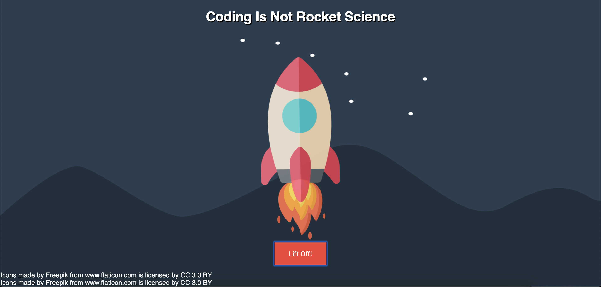

# Rocket-Science
This was a side project to prepare for a "start to code" workshop that I hosted at the Waterkant Festival 2019. In a group of four people the main goal was to show atendees that coding in fact is not rocket science. The website was built beforehand and during the workshop the atendees were guided through every single step to let the rocket "start".

